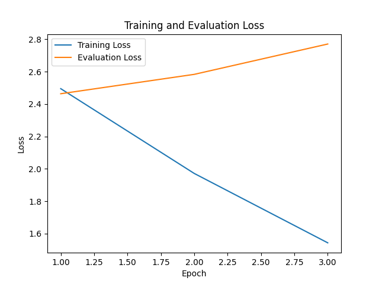
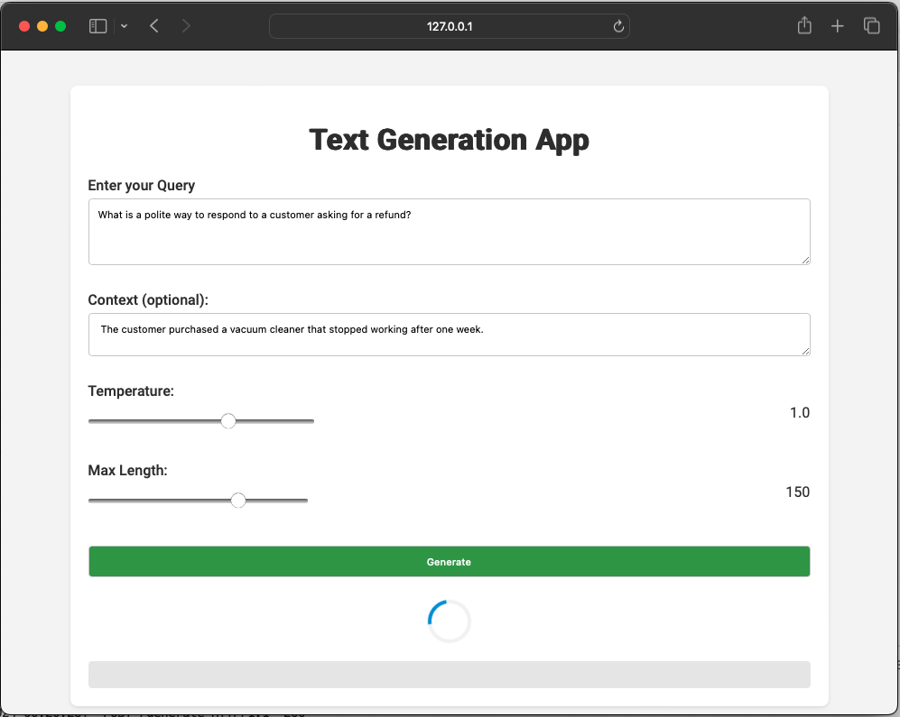
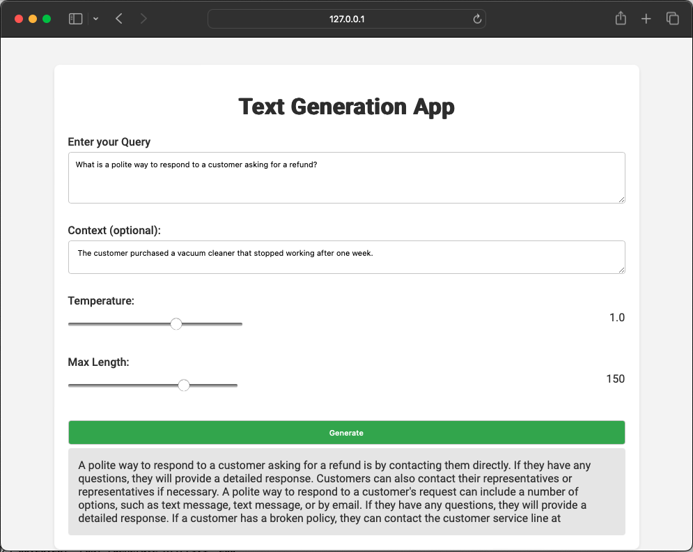

# Text Generation Project Overview

This project outlines the process of developing a text generation model utilizing the Alpaca dataset. It includes steps for dataset preparation, model training and evaluation, and deploying the model through a Flask web application for user interaction.

## Table of Contents
- [Prerequisites](#prerequisites)
- [Installation](#installation)
- [Dataset Preparation](#dataset-preparation)
  - [Training and Evaluation Datasets](#training-and-evaluation-datasets)
  - [Data Formatting and Tokenization](#data-formatting-and-tokenization)
- [Model Training](#model-training)
- [Model Evaluation](#model-evaluation)
  - [Loss Metrics and BLEU Scores](#loss-metrics-and-bleu-scores)
- [Web Application Deployment](#web-application-deployment)
  - [Running the Application](#running-the-application)
- [Conclusion](#conclusion)
- [Acknowledgements](#acknowledgements)

### Prerequisites

Ensure we have Python 3.x installed on system. Other key dependencies, we can install these packages via pip.

### Installation

To set up the environment and install the required dependencies for this project, follow these steps:

1. **Clone the Repository**: First, clone this repository to  local machine using Git:

```bash
git clone https://github.com/shaficse/Instruction-Tuning.git 
```

Install all required dependencies by running:

```bash
pip install -r requirements.txt
```
Model files are stored in [Google Drive Link](https://drive.google.com/drive/folders/1f_AQTAiZBNVa_OLEgTGH2aBrPA0dp5f8?usp=sharing)
## Dataset Preparation

### Training and Evaluation Datasets

The Alpaca dataset is divided into training and evaluation subsets. 
- The training dataset is limited to the first 100 examples to expedite the process, 
- while the evaluation dataset is limited to the first 25 examples.

### Data Formatting and Tokenization

- The DistilGPT-2 model and tokenizer are used, 
- setting the padding token to the end-of-sequence token and defining the maximum sequence length (1024). 
- A specific prompt format required for training the model is established, incorporating questions, optional inputs, and answers.

## Model Training

The model is trained using the Transformers library's 
- `TrainingArguments` and 
- a custom `SFTTrainer`. 

Training parameters are optimized for the dataset, and a `DataCollatorForCompletionOnlyLM` is configured for the completion-only language modeling approach.

## Model Evaluation

### Loss Metrics and BLEU Scores

Post-training, the model's performance is evaluated based on loss metrics and BLEU scores, providing insight into its ability to generate text that closely matches human-written text. 

---
##### Loss Metrics
| Epoch | Training Loss | Validation Loss |
|-------|---------------|-----------------|
| 1     | 2.4948        | 2.4634          |
| 2     | 1.9717        | 2.5829          |
| 3     | 1.5436        | 2.7701          |

 

- The **training loss** shows a **consistent decrease**, indicating effective learning and optimization by the model.

- The **validation loss** initially drops but then **increases**, suggesting the model might be **overfitting**. While the model is improving on the training data, its performance on unseen data (validation) worsens.


The training trends are positive, but the rise in validation loss points to a need for strategies to improve generalization, such as **early stopping**, **regularization**, or **model adjustments** to prevent overfitting.

---
#### Average BLEU Score 

- **Score**: 0.0061

#### Interpretation

- The **BLEU score** serves as a measure of the similarity between machine-generated text and human reference texts, with a scale ranging from 0 to 1. Higher scores signify a greater alignment with the reference text.
- An **average BLEU score of 0.0061** is notably low, indicating a significant deviation of the generated text from the human-written reference texts in the `eval_ds`.

#### Implications

- The minimal score suggests **challenges** the model encounters in grasping the subtleties of language or specific aspects of the given task.
- This emphasizes the necessity for additional **model refinement** or modifications to the **training data** to enhance the model's performance.

**Next Steps:**
- Investigating the **model's learning process**, increasing **data quantity and quality**, and Investigating the **evaluation setup** could provide insights into improving this score.
- Exploring **alternative models**, **hyperparameter tuning**, or **data augmentation** strategies might also enhance the model's ability to generate more accurate and human-like text.

## Web Application Deployment

A Flask application serves as the interface for model interaction. 
- Users can input **Query** and **Context(optional)** and adjust parameters like **temperature** and **max length** to influence the text generation. 

The application routes include a home page for input submission and a generate endpoint that returns the generated text.


### Running the Application

To start the Flask web application:

```bash
python app.py
```
   
    
Navigate to `http://127.0.0.1:5000/` in  web browser to interact with the application.

## Conclusion

This project demonstrates a comprehensive approach to developing a text generation model from dataset preparation through deployment in a web application. It utilizes modern tools and libraries, emphasizing user interaction and model performance evaluation.

## Acknowledgements

This project could not have been accomplished without the support and contributions from a variety of sources:

- **OpenAI and Hugging Face**: For providing the Transformers library, which is fundamental to the development of this project. Their work on making advanced NLP models accessible to the wider public has been invaluable.
- **PyTorch Team**: For developing and maintaining PyTorch, the deep learning framework that powers the model training and inference in this project.
- **The Datasets Contributors**: Special thanks to the creators and maintainers of the Alpaca dataset and the `datasets` library from Hugging Face, which facilitated the data handling and preprocessing tasks.
- **Flask Community**: For the Flask web framework, which made it possible to deploy this model as an interactive web application.
- **NLTK Developers**: For the Natural Language Toolkit (NLTK), which provided the tools necessary for evaluating the model's performance.
- **Matplotlib and NumPy Contributors**: For these essential Python libraries that aided in data visualization and numerical operations.
- **Community Feedback**: The insights and feedback from the community have been crucial in refining the model and improving the user interface of the web application.

Each contribution has played a significant role in bringing this project to fruition, and for that, I am deeply grateful.
